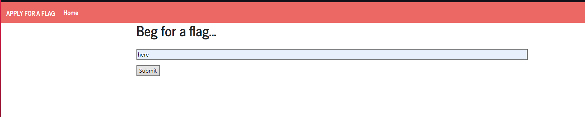
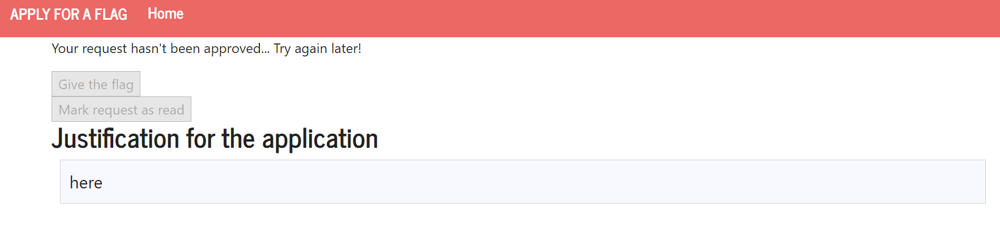
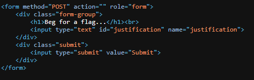
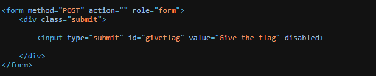
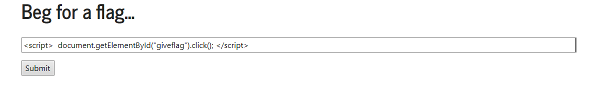
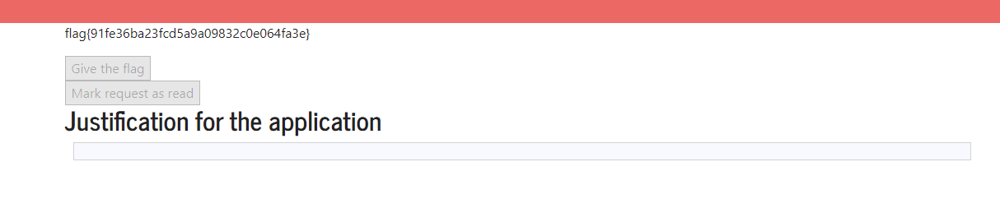
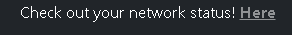
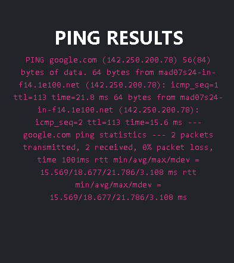
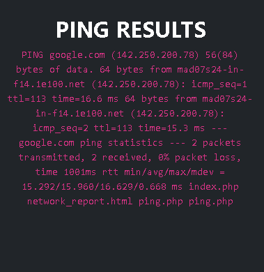
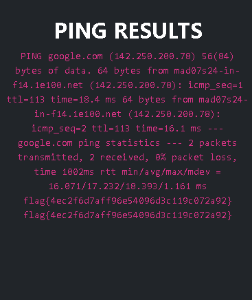

# CTF Week 10
## Challenge 1 
- Our first job was to use the website as a normal user, with the objective of sending a message to the admin and waiting for a response.

- When we sent the message there was a little delay, between sending the message and receiving a response from the admin, as expected we did not get permission from the admin to get the flag.
- Next we needed to look at the form html and see if there was a vunerability we could exploit, and there was.

- As we can see the user input that the form receives is not check by the webpage and the "Give the flag" button is only disabled, with this information we can conclude that we can do a xss attack using the form, with the objective of clicking the disabled button.
- After that, we create a exploit, that consists of writting a js script inside of the form input, that clicks on the button with the id of "giveflag".

- We then get the flag successfully.

## Challenge 2
- In this challenge, it's presented to us in http://ctf-fsi.fe.up.pt:5000/ a website to analise in black-box. 
- Without being authenticated, we can reach a page where we can ping an host. 

- In this page there is a input. 

- By sending "google.com", the program ping the server and prints. 

- This is probably done by the linux utility "ping" followed by our input. We can explore this by sending after the host a "&&" and any other function to execute.
- First we used "google.com && ls", and it worked. In the end, we can see the output of the ls. 

- Since our goal was to read the content of the flag.txt file, we used "google.com && cat /flags/flag.txt" and the result was the flag. 
 
