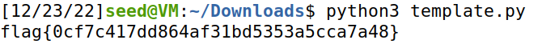
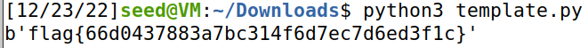

#  CTF Week 12-13

##  Part 1

- For this ctf we want to decrypt a RSA message, to do this we will need e, p, q, n and d. But we only know e = 65537 and that p is the next prime of 2^512 and that q is the next prime of 2^513. To get n we simply do p*q.

##  Task 1
- Has previously mentioned p is the next prime of 2^512 and q is the next prime of 2^513

p=13407807929942597099574024998205846127479365820592393377723561443721764030073546976801874298166903427690031858186486050853753882811946569946433649006084171

q=26815615859885194199148049996411692254958731641184786755447122887443528060147093953603748596333806855380063716372972101707507765623893139892867298012168351


##  Task 2
- To calculate the private key we allredy have all the necessary components e, p and q, so to calculate d we need to find a value
for d that (d*e) mod ((q-1)*(p-1)) = 1. After doing this equation we get:

d=283825783985341946693572587547983531801759790599384081807167819057218295481129677239843318514795498225084157397776108358693109159082126382998610088089596393785492544708789932746498607854229561012922444033838281096216274142752955492163886580635360247432459607808556160343559732576651476555582420459678673469473

##  Task 3
- After knowing the private key we only needed to run the python script and we get the following flag:



- This is the code in our script:

```python
from binascii import hexlify, unhexlify

p = 13407807929942597099574024998205846127479365820592393377723561443721764030073546976801874298166903427690031858186486050853753882811946569946433649006084171
q = 26815615859885194199148049996411692254958731641184786755447122887443528060147093953603748596333806855380063716372972101707507765623893139892867298012168351
n = p*q
v = (p-1)*(q-1)
e = 0x10001
x, y = 0, 1
enc_flag = "0000000000000000000000000000000000000000000000000000000000000000000000000000000000000000000000000000000000000000000000000000000000000000000000000000000000000000000000000000000000000000000000000000000000000000000000000000000000000000000000000000000000000000b23aff3026301f965bbf9e4d3e3c944b758d0a956d937cb856b1e4ccd5f8d2e168ad76d53bcbd2531f37688e254bfdf00933938d5c1e7cab31f10508fe82ce1c924550819bee51bf31f53e9a780692b6ca0288d8980a43313b0bcdd261d0e9b4475914ec6d0880dac04e200b782c060ed7f27d988157ed42ea45d97245851b41"

def gcdExtended(a, b):
    global x, y
 
    if (a == 0):
        x = 0
        y = 1
        return b
 
    gcd = gcdExtended(b % a, a)
    x1 = x
    y1 = y
 
    x = y1 - (b // a) * x1
    y = x1
 
    return gcd
 
 
def modInverse(A, M):
 
    g = gcdExtended(A, M)
    if (g != 1):
        print("Inverse doesn't exist")
        return 0
 
    else:
 
        res = (x % M + M) % M
        return (res)
        


def enc(x):
    int_x = int.from_bytes(x, "big")
    y = pow(int_x,e,n)
    return hexlify(y.to_bytes(256, 'big'))

def dec(y):
    int_y = int.from_bytes(unhexlify(y), "big")
    x = pow(int_y,d,n)
    return x.to_bytes(256, 'big')
    
d = modInverse(e, v);
y = dec(enc_flag)
print(y.decode())
```

## Part 2

- For this ctf we want de decrypt a message again, but this time we are given the same n but diferent public keys and we receive the same message encrypted two 2.

# Task 1

- We are given two public keys and a n that is used two times for the same message:

e1 = 0x10001
e2 = 0x10003

n = 29802384007335836114060790946940172263849688074203847205679161119246740969024691447256543750864846273960708438254311566283952628484424015493681621963467820718118574987867439608763479491101507201581057223558989005313208698460317488564288291082719699829753178633499407801126495589784600255076069467634364857018709745459288982060955372620312140134052685549203294828798700414465539743217609556452039466944664983781342587551185679334642222972770876019643835909446132146455764152958176465019970075319062952372134839912555603753959250424342115581031979523075376134933803222122260987279941806379954414425556495125737356327411 

- With this information we can conclude that we need to do a Common Modulus attack.

# Task 2

- To create this attack we used https://infosecwriteups.com/rsa-attacks-common-modulus-7bdb34f331a5 to create our script. Before analysing the site, we already knew that:<br>
C1 = M^e1 mod N<br>
C2 = M^e2 mod N<br>
- Being C1 and C2 the criptographed messages, (the flag), sent in Message 1 and Message 2, e1 and e2 the public exponent used in each message, M the flag uncrypted and N the common modulus. During our research in the website mentioned above we came across with the Bezout’s Theorem, that states that if there are integers a and b, which are not both zero, then there are integers x and y such that:<br>
xa + yb = gcd(a,b)<br>
- In our case, this can be used with our two public exponent as such:<br>
xe1 + ye2 = 1<br>
- Since e1 and e2 are coprimes. Now, using the Extended Euclidean algorithm we can find the x and y, and with them, answer the following equation:<br>
M = C1^x * (C2^-1)^-y<br>
- Using this as base, we contructed the following python code:

```python
import math
from binascii import unhexlify

c1=0x12b639eff923558f8973266ead9f91acf7ac0cc06d29020339b79285d5e78602117d8dc58b9015f3056503b67a1aeb4b30d9d8e2bb88cac514e79f647e8dfd57185469e19bd28523a176aa3601dfd03db20a90588bb0fa20313ea10e22853a6cc29785b1228a772286bfe817e07399f4157fbb7543956efdf9e6d0d8fe841778ddefe05c745e6c10256d8f7832034dff21857c1a3184d0ced077f64fc4352df13d80131085e76887d3b2099738e2659d5ab43ae779fc44c8cd1bc49ea4453c60ab595475afd73966df0691485c2980ec98942f207d549454299523d4dadd467ca9ba6f70c1e79349cfe9b8dd5e1e9307e54e4afcf11480b8238a00bd2bc90dc2
c2=0x84bb73b1f4da65a45523155109054a2b3c18bf89735837da1fbfc1f128dd26731796ea46c4bf7470204e7bcbe9472f4d959d4e97fefcea02e2500330868a2f458e331f8f5b43bebee911ac71feb53d9a4ffd15ded1d2c408326c4a657881e6d3f4d21ae914f9a117d2f1396563932ca83b5eb5cf5dd341887ce231590609be1253293e85c61607f183f8808bb3c2ea44d650291e348309d4a2841e0921c1ea7d7f9f8692c73e96a44079225e599792156791c23fb2d1aff8b4fb5c151637ee6bdb7e9c3eb814546d28914b60ccc8071a273a6d0306aa748ee30a039485b9d2283b0e1c96403edbcb71e5e3e86e09504d55fa2bff68af8111c4f26deb9a3a57b2
e1=0x10001
e2=0x10003
N=29802384007335836114060790946940172263849688074203847205679161119246740969024691447256543750864846273960708438254311566283952628484424015493681621963467820718118574987867439608763479491101507201581057223558989005313208698460317488564288291082719699829753178633499407801126495589784600255076069467634364857018709745459288982060955372620312140134052685549203294828798700414465539743217609556452039466944664983781342587551185679334642222972770876019643835909446132146455764152958176465019970075319062952372134839912555603753959250424342115581031979523075376134933803222122260987279941806379954414425556495125737356327411
s1 = pow(e1, -1, e2)
s2 = (math.gcd(e1, e2) - e1 * s1) // e2
temp = pow(c2, -1, N)
m1 = pow(c1, s1, N)
m2 = pow(temp, -s2, N)
message = (m1 * m2) % N
print(unhexlify(hex(message)[2:]))
```

# Task 3

- After running the code above we get the following flag:


