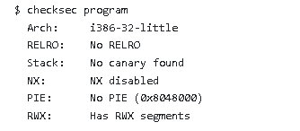
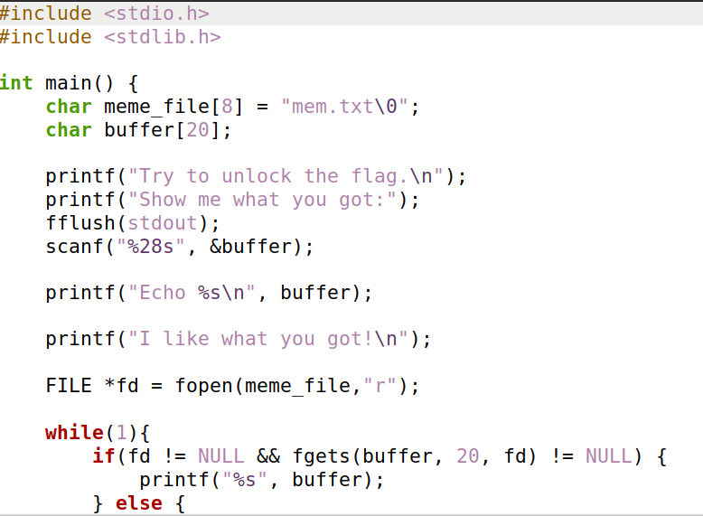
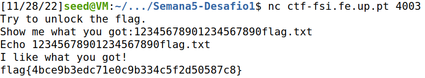
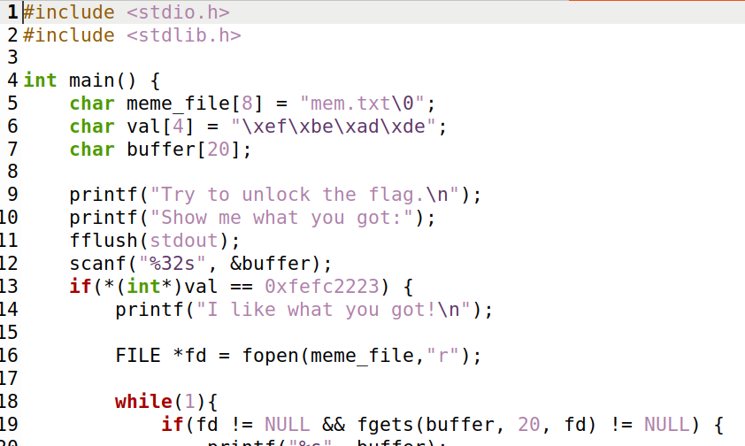
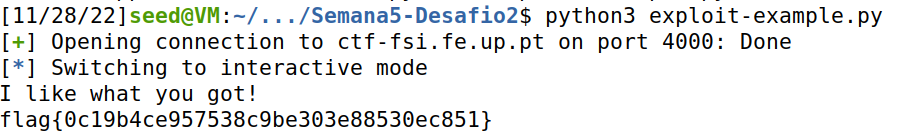

# CTF Week 5
- Added due to class request.
## Challenge 1
- Our goal was to read a flag.txt file located in the working directory. To do that we had to take control of the functionalities of the program running.
- Running checksec we got this.

- Upon analysis, we can see that the file architecture is x86 (Arch), there is no cannary protecting the return address (Stack), the stack has execution permission (NX), and the binary positions are not randomized (PIE ), finally there are memory regions with read, write and execute (RWX) permissions, in this case referring to the stack.

- Now analysing the program main file:
- Is there any file that is open and read by the program ? 
    - Yes, mem.txt.
- Is there any way to control the file that is open?
    - By the value writing in the meme_file array.
- Is there any buffer-overflow? If so, what can we do?
    - Overflow the buffer in order to rewrite the meme_file array content to flag.txt.
    scanf reads 28 bits and buffer as only 20.


- First we send 20 bits to fill the buffer array, and then we send the flag.txt string to overwrite the content of the meme_file array. This way the flag.txt will be the ine to be open and the flag is shown.

## Challenge 2
- Checksec runned, results are the same.

- This time we can see that a new array has added, the val array. There is also a verification that compares this new value to 0xfeffc2223. 
- The overflow is still possible since the scanf gets 32 bits and the buffer has a 20 bits lenght. 
- We can use a similar tecnique, but this time we have to also overwrite the val array to change its value to 0xfefc2223.
- This time we decided to use a python script.
```python
#!/usr/bin/python3
from pwn import *

DEBUG = False

if DEBUG:
    r = process('./program')
else:
    r = remote('ctf-fsi.fe.up.pt', 4000)

r.recvuntil(b":")
r.sendline(b"12345678901234567890\x23\x22\xfc\xfeflag.txt")
r.interactive()
```
- Like before, we send 20 bits to fill the buffer, then overwrite the val array to surpass the lock created in this challenge, and then overwrite the file to be open.
