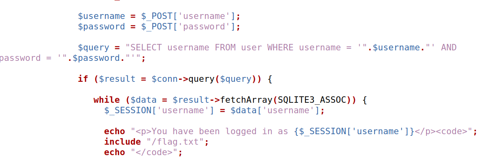
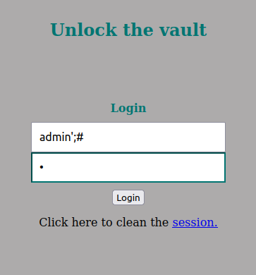
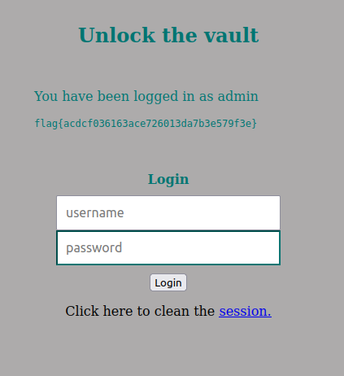
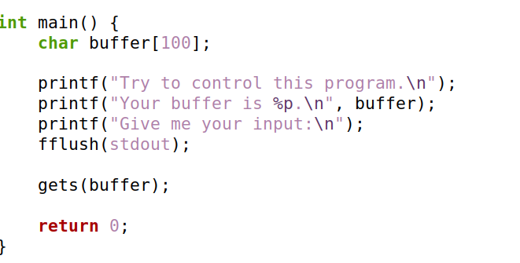
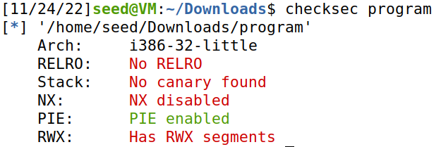
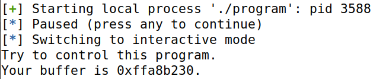
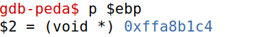
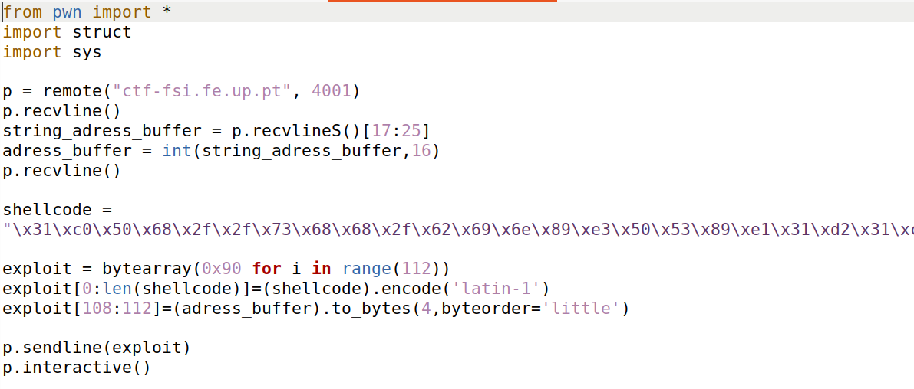
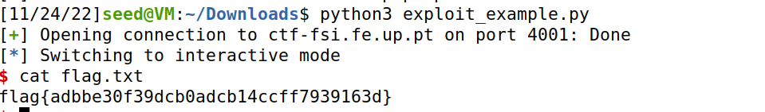

# CTF Week 8
## Challenge 1 
- In ctf-fsi.fe.up.pt::5003 there's a PHP web server. This web server has a login functionality that uses a sql database to storage the user's data.
Our goal was to login as admin.

- By analising the code above, we could see that it was possible to execute an SQL injection by the same strategy used in the task 1 in the logbook of week 8. We utilized the username admin, followed by a ' to close the one bewind, then a ;# to end the line there and comment the rest.

## Challenge 2
- Our goal was to create an exploit to allow us to call a shell inside the server to be able to reach the flag file inside the program's working directory.

- By analising the source code, it possible to see that a buffer overflow is possible, since a user input can surpass the buffer size.

- By running checksec, it visible that there is no RELRO, no canary, that the stack has execution permission and that there is randomization.

- Running the program we get the buffer address.
Using the gdb we can also see the ebp value. Obtaining this two values we can calculate the offset used in the exploit, by subtraction one to the other: 0xffa8b230 - 0xffa8b1c4 = 0x6c (108 in decimal).
- The exploit needed was similar to the one used in task3 of logbook5. Using that one as base we created this. First the shellcode ,followed by NOPs until the 109 byte, where enters the buffer address readed by the recvlineS().

- Running this script we obtain the root shell and access the flag.
