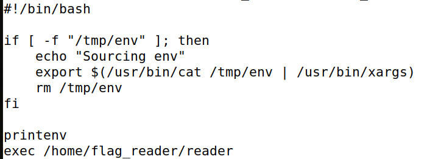
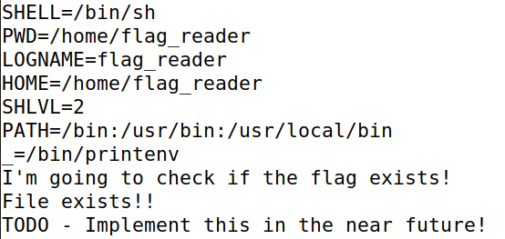
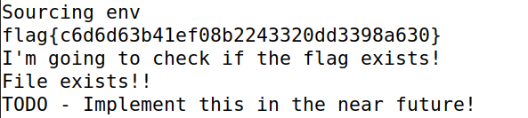

# **British Punctuality**
- After connecting to the server, we can see three files, a main.c and a reader, probably of the same program, and a script. We could also see that we didn't had permission to access the file intended.
- This script checks if a file /tmp/env exists, if so it exports the variables in the file to the environment. We can also see it call the printenv with relative path.
- So this means we can change the env variables such as the PATH to alter the "printenv" executed.

- After more search, we found the /tmp file, were we could write. In this folder we found a file called last_log. By this file and by the name of the CTF, we guessed that the script was being run with a timer, and with previlegies.
 
- With this in mind, it was simple. We had to change the PATH to the /tmp file in order to execute a printenv of our own.
- We changed the path by writing in env:
```
PATH="/tmp:/command:/usr/local/sbin:/usr/local/bin:/usr/sbin:/usr/bin:/sbin:/bin"
```
- And created and compiled in /tmp a new printenv
```c
#include <stdio.h>
#include <stdlib.h>

int main(){
    system("cat /flags/flag.txt");
}
```
- By running this program, no success could be achieved, but if we waited until the timer ran the sh by its own, we can find the flag inside the last_log:
