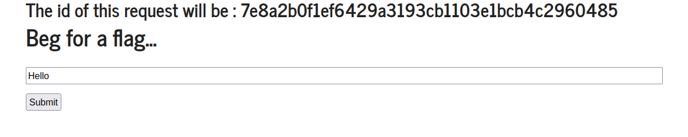
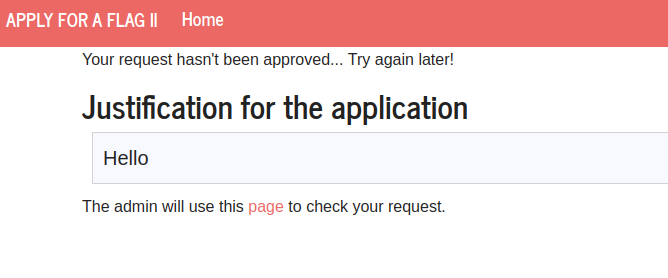
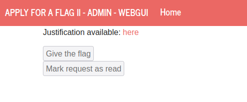
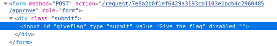
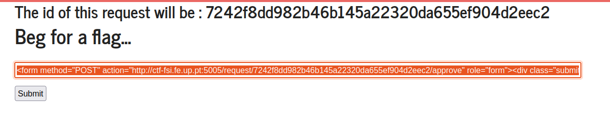
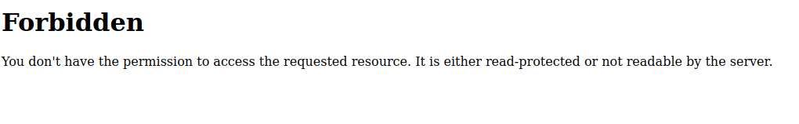
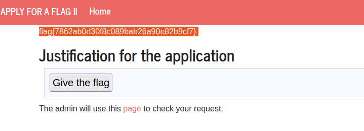

# **Apply for Flag II**
- This ctf seamed at first time similar to the other apply for flag.

- The difference is that this time the button to give the flag and the output of our justification are in different pages:


- Like in the first one, it's possible to insert malicious input in the first page.
- Analysing the HTML of the ADMIN page, we see that the button submits a form with an action that activates the flag.

- Since the admin has to move to the justification page, a XSS atack is still possible. Our idea was to recreate the button and click on it inside a script in the input.

```html
<form method="POST" action="http://ctf-fsi.fe.up.pt:5005/request/7242f8dd982b46b145a22320da655ef904d2eec2/approve" role="form">
    <div class="submit">
        <input type="submit" id="giveflag" value="Give the flag">
    </div>
</form>
<script>document.getElementById('giveflag').click();   </script>
```
- Submiting this gave us this page:

- After thinking a bit, we figured out that should be because we were also clicking the button. 
- To fix that we deactivated our browser's javascript.
- We started from the begging now with the js off, and after submiting our exploit, the result was this flag:
