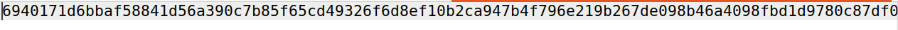
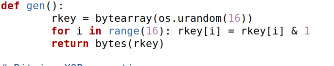
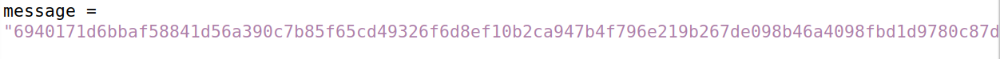
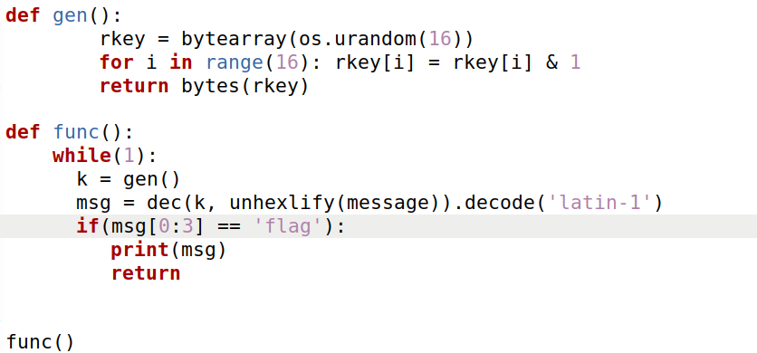
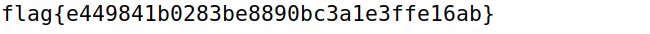

# **Number Station 3**
- In this ctf our goal was to decifer the message. Accessing the server we can see the message being printed:

- Analysing the py file given, three functions:
    - gen(), to generate the cryptographic key k
    - enc(k,m), that encodes a message m using key k
    - dec(k,c), that decodes a message c using a key k
- We can see that the key to the crypt is made by 16 random bytes.

- Since we already had the decypher function, our idea as just a simple brute force: generate keys and try to decipher until is starts as 'flag':

- After some time, the flag happeared: 
