# CTF Week 10
## Task 1
- Our first task is to put malicious javascript code in the user profile, in a way that when someone views the user profile it makes an alert message saying "XSS".
- To do this we put the code in the brief description.
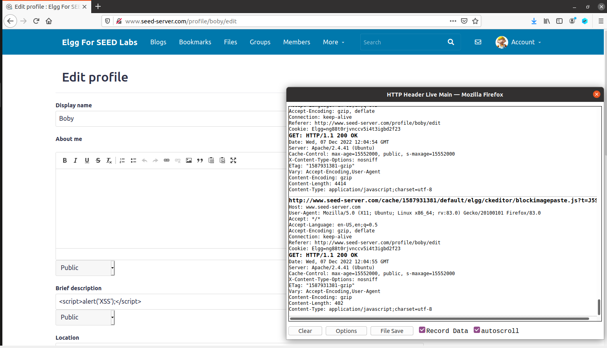
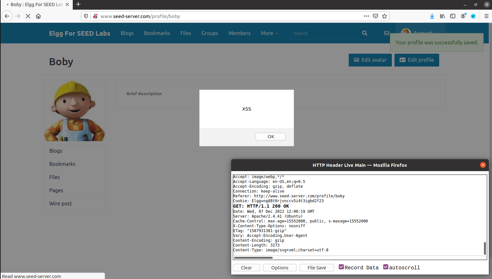
- Since the brief description is not showing, we know that the code was executed.
## Task 2
- This task is very similar to the first one, but insted of showing a alert with "XSS" in it, we display the users cookies.
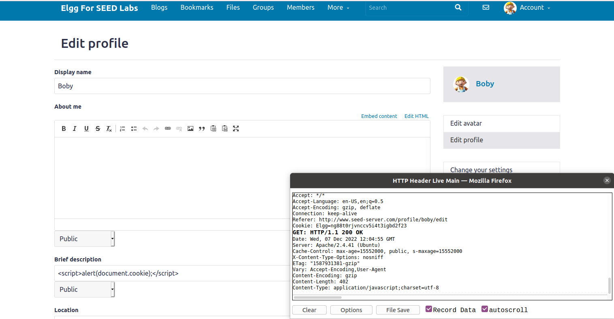
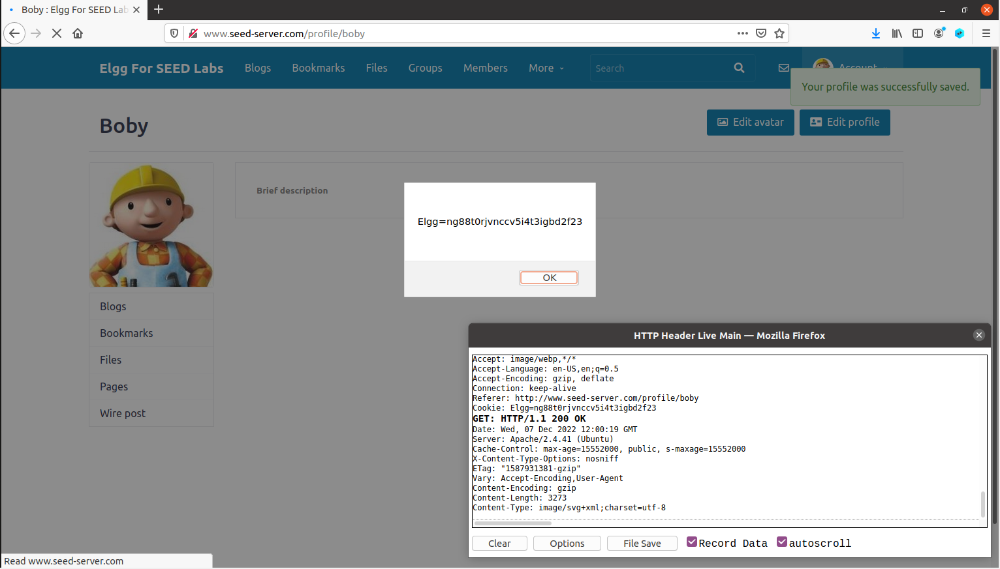
## Task 3
- In this task we want the cookies for ourselfs, soo displaying a message of the cookies to the users is useless.
- To do this we need to send the cookies to port 5555 with ip 10.9.0.1, where there is a TCT server listening to the same port.
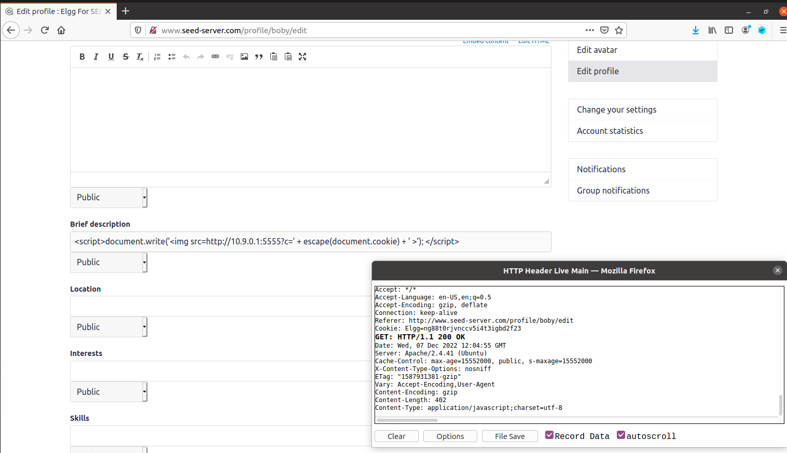
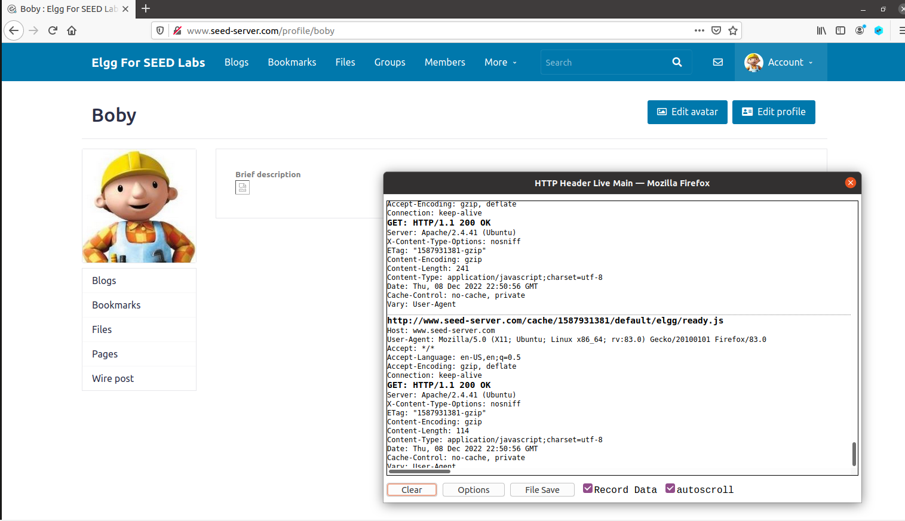
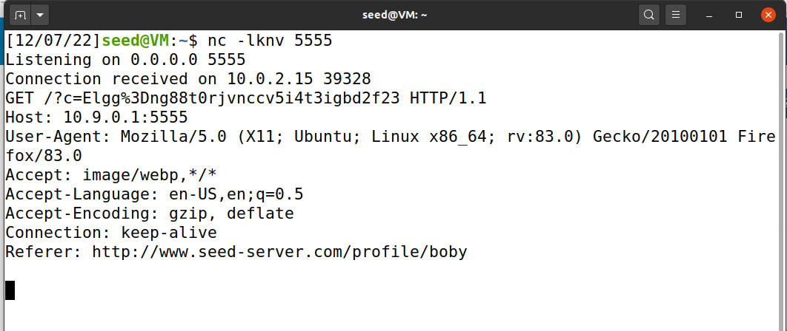
- This is possible because the image is trying to load from the src url, making a HTTP GET request, wich then sends the victims cookies to the attaker.
## Task 4
- For the last task we want everyone that visits samy profile to become his friend.
- First we added samy has a friend in bobys account, to see the HTTP request we got.
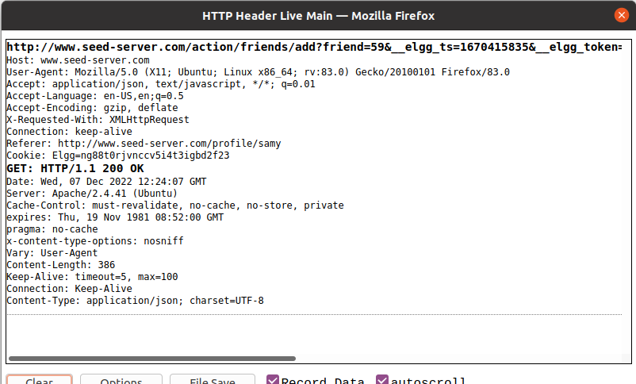
- As we can see samy id is 59, and then we put this script in the brief description.
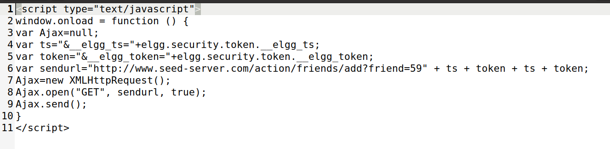
- Boby has no friends, but when he visits samy profile he becomes his friend.
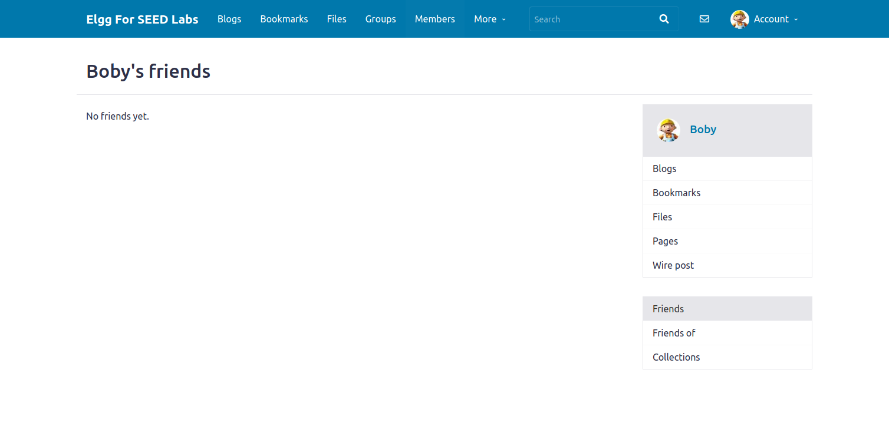
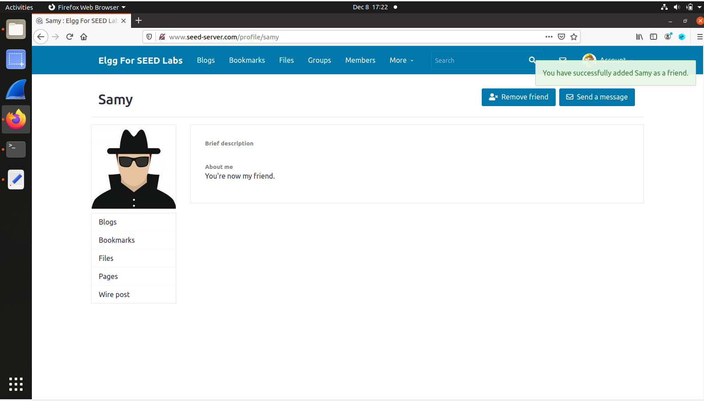
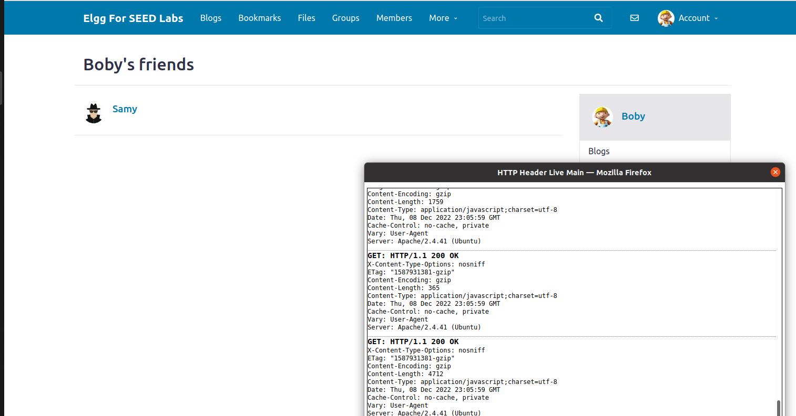
