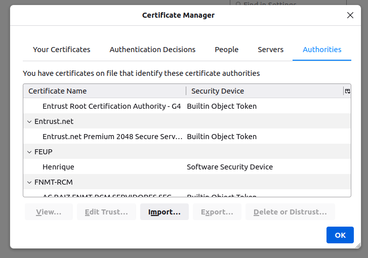

# **LOGBOOK 12 - Public-Key Infrastructure (PKI) Lab**
## **Task 1**
- After doing the pre-work needed, we start copying openssl.cnf to our working directory and changing it acording to the instructions.
- We also had to create two new files, index.txt and serial.
- Next thing to do has to generate a self-signed certificate for our
CA.

-  The output of the command were stored in two files: ca.key and ca.crt. The file ca.key contains the CA’s private key, while ca.crt
contains the public-key certificate.
- Analysing the two files, we can get the questions to this questions:
    - What part of the certificate indicates this is a CA’s certificate?
        - Inside the file, the CA flag in the Basic Contraints is marked as true.
     
    - What part of the certificate indicates this is a self-signed certificate?
        - We can see that the issuer and the subject of the certificate are the same person, me, so it is self-signed.
      
    - In the RSA algorithm, we have a public exponent e, a private exponent d, a modulus n, and two secret
    numbers p and q, such that n = pq. Please identify the values for these elements in your certificate
    and key files.

Public exponent | Private exponent | modulus n| p | q | 
:---------:|:---------:|:---------:|:---------:|:---------:
  |  |  |  | |

## **Task 2**
- In this task we needed to generate a Certificate Signing Request (CSR). Also needed to add two alternative names to our certificate signing request. 
 

## **Task 3**
- This talk goal was to generate a Certificate for our server. After changing the conf file, we turn the certificate signing request (server.csr) into an X509
certificate (server.crt), using the CA’s ca.crt and ca.key.
 
- We can see that the alternate names are included in the server.csr file.

## **Task 4**
- Our goal is to deploying Certificate in an Apache-Based HTTPS Website. 
- First we need to change the bank32_apache_ssl.conf file, changing the names of the keys and certificates we created.
- Next we build, access the docker console and start an apache server.

- If we try to access the site, we are unable and the firefox browser shows this message.

- Clicking in "View Certificate" we get this, our certificate:

- To be able to access the site, we need to add our certificate to the firefox authorized ones. 

- After that we can access the website freely.

## **Task 5**
- In this task our goal is to try to launch a man-in-the-middle attack.
- First we changed the conf file, changing the ServerName to the intended and added www.example.com to the hosts file.

- Running the server and accessing the site, we can see that the attack was detected, since we have a risk message.

## **Task 6**
- In this task our goal is to launch a successful man-in-the-middle attack.
- We should assume that the root CA created in Task 1 is compromised by the attacker, and its private key
is stolen. Therefore, the attacker can generate any arbitrary certificate using this CA’s private key.
- We just needed to use the key stolen (ca.key) to create our key. We will repeat what has done before:

- The conf file is the same except for the certificates being the new ones.

- And the same in the dockerfile.

- After running and starting the server in apache, we can get to the site without any problem.
