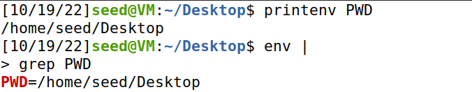
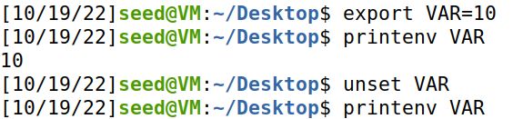
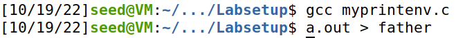
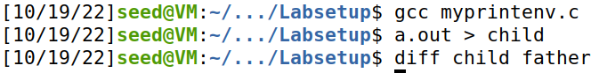
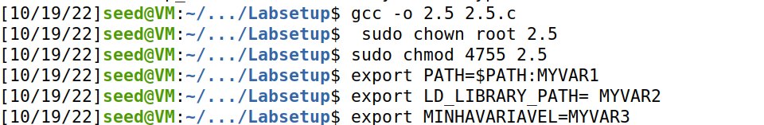
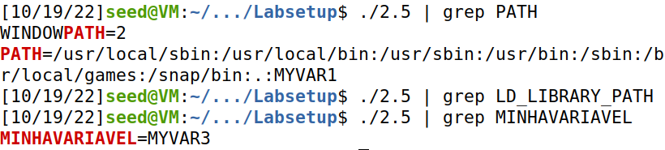
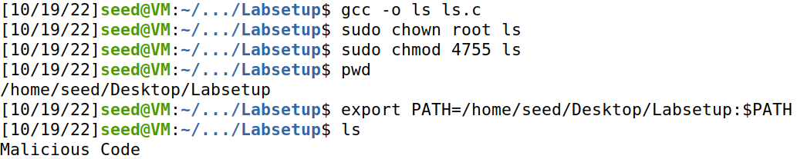

# LOGBOOK 4 - Environment Variable and Set-UID Program Lab
## 2.1

## 2.2
### Step 1
The program prints the child process' environment variables.

### Step 2
After the change, the program prints the parent process environment variables. By executing "diff" between the two results, we can see that the two results are equal. Therefore, we can conclude that the parent’s environment variables are inherited by the child process.

## 2.3
### Step 1
The program does not print anything.

### Step 2
The program prints all the normal environment variables.

### Step 3
A program executed by execve() gets his environment variables from the third paramenter.

## 2.4
The program prints all the normal environment variables.

## 2.5
### Step 1 & 2

### Step 3
It's possible to see that the PATH variable and the new variable we created were passed to the child process. The surprise is that the LD_LIBRARY_PATH doesn't even exist in the child process.

## 2.6

After creating a new "ls" and changing the PATH variable, we can alter the result of the ls command and running our "malicious code".
