# **LOGBOOK 6 - SEED Labs – Format String Attack Lab**
## **Task 1**
- We start this task by running the servers. After that, we send a "hello" message to the server running on 10.9.0.5. 
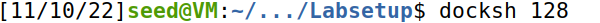

User | Server
:---------:|:---------:
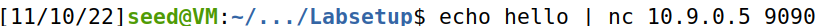 | 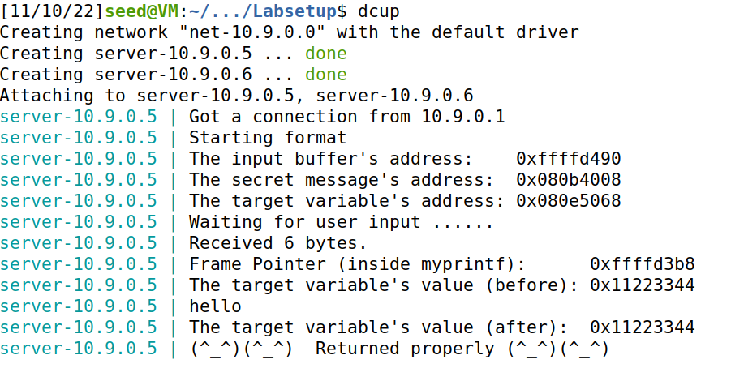

- The other objective in this task was to crash the program. It's visible that by sending "%s" to the server, the program crashes.

User | Server
:---------:|:---------:
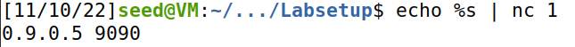 | 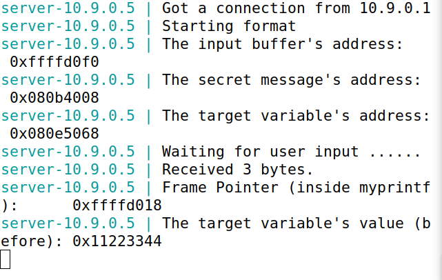

## **Task 2**
### **2.A**
- Our goal was to print out the data on the stack.
To know how many "%x" where needed we tested a big number of them after a "A B C" string.

User | Server
:---------:|:---------:
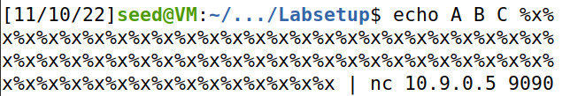 | 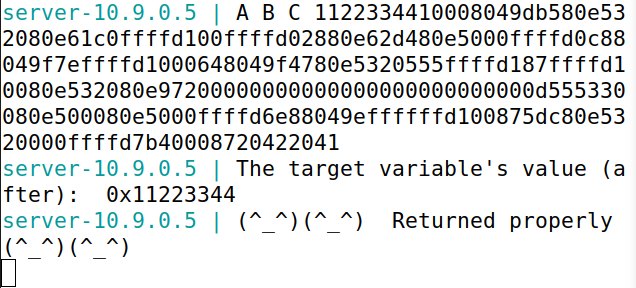

- In the server side we can see the printing of B and A in ASCII, so we removed the extra "%x" until our string wasn't printed in. The number of "%x" was 63.

User | Server
:---------:|:---------:
 | 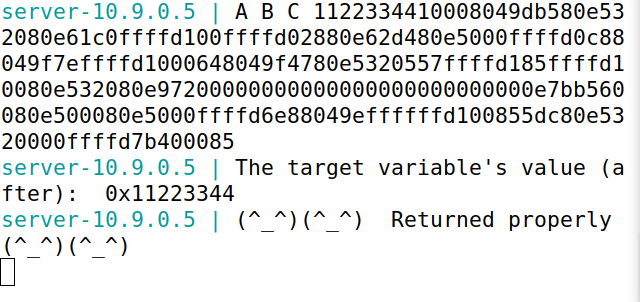

### **2.B**
- Our objetive were was to print the secret message. In order to do that we needed to place the address in the binary form in the beggining of our message and a "%s" in the end. 

User | Server
:---------:|:---------:
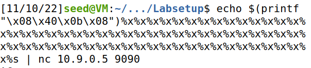 | 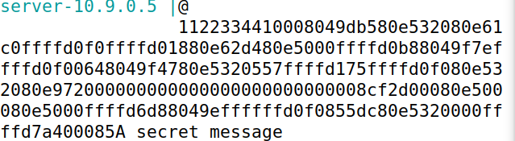

## **Task 3**
### **3.A**
- In this sub-task, we needed to change target value to a different value. To do that, we changed the address in the begging to the address of the target and added a "%n" in the end. This special format specifier changed the target value to the number of characters printed before it: 8 times 63 plus 4 of the address equals 508, in hex 0x1fc.

User | Server
:---------:|:---------:
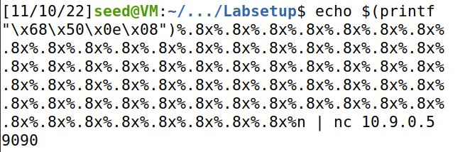 | 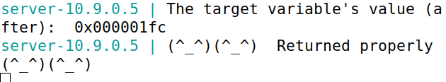

### **3.B**
- In this sub-task, we need to change the content of the target variable to 0x5000. This time we needed that sum was equal to 20480 (0x5000 in decimal). 8 times 62 plus 19980 plus 4 equals 20480. 

User | Server
:---------:|:---------:
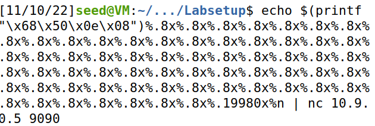 | 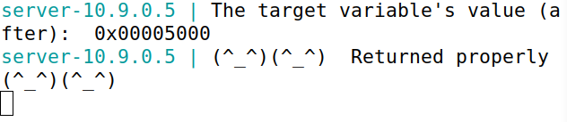
