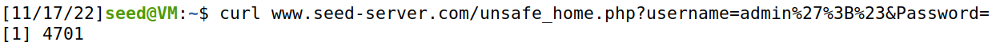
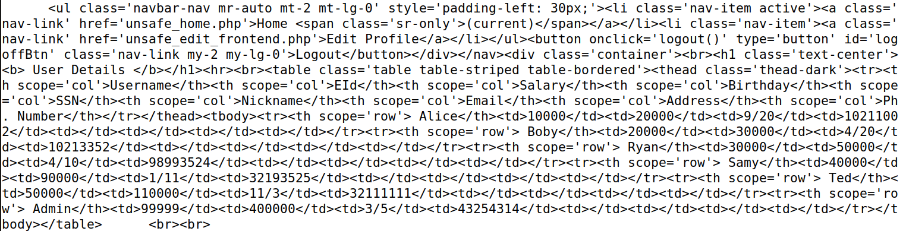
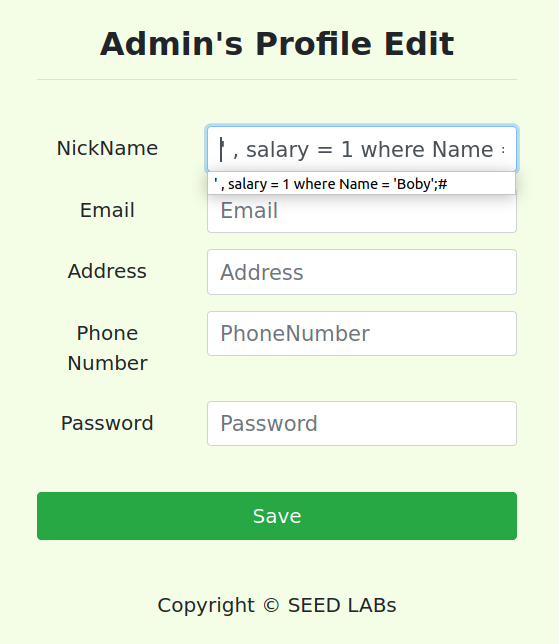
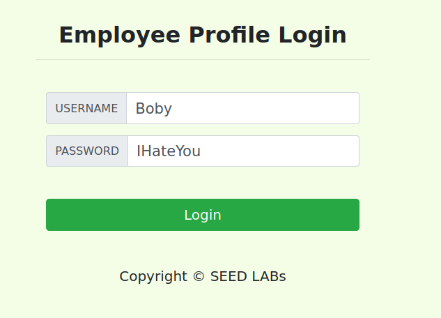

# **LOGBOOK 7 – SQL Injection Attack Lab**
## **Task 2**
The objective of this task is to get familiar with SQL commands by playing with the provided database
- We start this task by running the servers. After that, we used a SQL command to print all the profile information
of the employee Alice 

### **2.1**
- Our goal was to log into the web application as the
administrator from the login page, so you can see the information of all the employees.

- For that we used a combination of strings to mess with the sql statement in the login form.

### **2.2**
- Our task was to repeat Task 2.1, but without using the webpage.

### **2.3**
- Our objetive were was 
run two SQL statements via the login page. But we were unable to do it because of the way the function querie() works. 

## **Task 3**
- In this task we had to use injections to change the database.

### **3.1**
- In this sub-task, we need to change our salary. We by mistake also changed the name from Alice to Ana when we were testing the queries. 

### **3.2**
- In this sub-task, we need to Modify other people’ salary. Our target was Bob and his salary got reduced to 1 

### **3.3**
- In this sub-task, we need to modify other people’s password. Our target was Bob. We had to hasg the new password. All that in the next screenshots 

